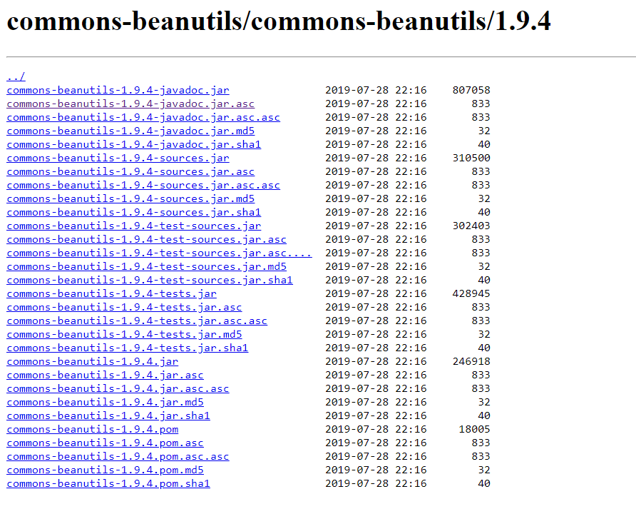

# Maven dependency checksum verification

Maven repositories automatically generates checksums using `MD5` and `SHA1` for each deployed artifacts.



The maven CLI leverages those checksums when downloading artifacts from repositories to verify the package integrity.

**Depending on the maven version that you use, the impact of a checksum verification failure on your build is different.**

## Mock repository setup

For this step, you need to have [Docker](https://docs.docker.com/engine/install/) installed.

We're going to set up a mock maven repository hosting an altered version of [commons-beanutils-1.9.4](https://repo1.maven.org/maven2/commons-beanutils/commons-beanutils/1.9.4/) where checksums are **erroneous**.

```shell
docker run -d -p 5000:80 --name custom-maven-repo -v ./repository-files:/usr/share/nginx/html nginx:1.25.1
```

## Maven < 4.0.0

### Default behavior

1. Delete any local copy of `commons-beanutils-custom`

```shell
rm ~/.m2/repository/commons-beanutils/commons-beanutils-custom
```

2. Build the project

```shell
mvn clean install
```

3. Check the build outcome

```
[INFO] Scanning for projects...
[INFO] 
[INFO] Using the MultiThreadedBuilder implementation with a thread count of 3
[INFO] 
[INFO] -----------------< com.syalioune:dependency-checksum >------------------
[INFO] Building dependency-checksum 1.0
[INFO] --------------------------------[ jar ]---------------------------------
Downloading from local-mock-registry: http://localhost:5000/commons-beanutils/commons-beanutils-custom/1.9.4/commons-beanutils-custom-1.9.4.pom
[WARNING] Checksum validation failed, expected 42e7c39331e1735250b294ce29840e434ebc955 but is 6e3b205edece1aa2dea644a3c36b736b6c448f4f from local-mock-registry for http://localhost:5000/commons-beanutils/commons-beanutils-custom/1.9.4/commons-beanutils-custom-1.9.4.pom
[WARNING] Could not validate integrity of download from http://localhost:5000/commons-beanutils/commons-beanutils-custom/1.9.4/commons-beanutils-custom-1.9.4.pom
org.eclipse.aether.transfer.ChecksumFailureException: Checksum validation failed, expected 42e7c39331e1735250b294ce29840e434ebc955 but is 6e3b205edece1aa2dea644a3c36b736b6c448f4f
...
[INFO] ------------------------------------------------------------------------
[INFO] BUILD SUCCESS
[INFO] ------------------------------------------------------------------------
[INFO] Total time:  2.119 s (Wall Clock)
[INFO] Finished at: 2023-06-25T21:47:24+02:00
[INFO] ------------------------------------------------------------------------
```

⚠️😱 **Maven will only emit a warning in case of checksum mismatch and your build can succeed** ⚠️😱

## Strict checksum verification

1. Delete any local copy of `commons-beanutils-custom`

```shell
rm ~/.m2/repository/commons-beanutils/commons-beanutils-custom
```

2. Build the project

```shell
mvn clean install -C
```

3. Check the build outcome

```
[INFO] Scanning for projects...
[INFO] 
[INFO] Using the MultiThreadedBuilder implementation with a thread count of 3
[INFO] 
[INFO] -----------------< com.syalioune:dependency-checksum >------------------
[INFO] Building dependency-checksum 1.0
[INFO] --------------------------------[ jar ]---------------------------------
Downloading from local-mock-registry: http://localhost:5000/commons-beanutils/commons-beanutils-custom/1.9.4/commons-beanutils-custom-1.9.4.pom
[WARNING] Checksum validation failed, expected 42e7c39331e1735250b294ce29840e434ebc955 but is 6e3b205edece1aa2dea644a3c36b736b6c448f4f from local-mock-registry for http://localhost:5000/commons-beanutils/commons-beanutils-custom/1.9.4/commons-beanutils-custom-1.9.4.pom
[IJ]-18-ARTIFACT_DOWNLOADING-[IJ]-path=-[IJ]-artifactCoord=commons-beanutils:commons-beanutils-custom:pom:1.9.4-[IJ]-error=
Downloading from central: https://repo.maven.apache.org/maven2/commons-beanutils/commons-beanutils-custom/1.9.4/commons-beanutils-custom-1.9.4.pom
[INFO] ------------------------------------------------------------------------
[INFO] BUILD FAILURE
[INFO] ------------------------------------------------------------------------
[INFO] Total time:  1.056 s (Wall Clock)
[INFO] Finished at: 2023-06-26T19:33:16+02:00
[INFO] ------------------------------------------------------------------------
```

ℹ️ **You need to explicitly add the `-C` option to enable strict checksum verification for maven < 4.0.0** ℹ️

## Maven 4.0.0

1. Delete any local copy of `commons-beanutils-custom`

```shell
rm ~/.m2/repository/commons-beanutils/commons-beanutils-custom
```

2. Build the project

```shell
mvn clean install
```

3. Check the build outcome

```
[INFO] Scanning for projects...
[INFO] 
[INFO] Using the MultiThreadedBuilder implementation with a thread count of 3
[INFO] 
[INFO] -----------------< com.syalioune:dependency-checksum >------------------
[INFO] Building dependency-checksum 1.0
[INFO]   from pom.xml
[INFO] --------------------------------[ jar ]---------------------------------
[WARNING] Version not locked for default bindings plugins [maven-clean-plugin, maven-resources-plugin, maven-compiler-plugin, maven-surefire-plugin, maven-jar-plugin, maven-install-plugin], you should define versions in pluginManagement section of your pom.xml or parent
Downloading from local-mock-registry: http://localhost:5000/commons-beanutils/commons-beanutils-custom/1.9.4/commons-beanutils-custom-1.9.4.pom
[WARNING] Checksum validation failed, expected '42e7c39331e1735250b294ce29840e434ebc955' (REMOTE_EXTERNAL) but is actually '6e3b205edece1aa2dea644a3c36b736b6c448f4f' from local-mock-registry for http://localhost:5000/commons-beanutils/commons-beanutils-custom/1.9.4/commons-beanutils-custom-1.9.4.pom
[IJ]-18-ARTIFACT_DOWNLOADING-[IJ]-path=-[IJ]-artifactCoord=commons-beanutils:commons-beanutils-custom:pom:1.9.4-[IJ]-error=
Downloading from central: https://repo.maven.apache.org/maven2/commons-beanutils/commons-beanutils-custom/1.9.4/commons-beanutils-custom-1.9.4.pom
[INFO] ------------------------------------------------------------------------
[INFO] BUILD FAILURE
[INFO] ------------------------------------------------------------------------
[INFO] Total time:  1.247 s (Wall Clock)
[INFO] Finished at: 2023-06-26T19:40:04+02:00
[INFO] ------------------------------------------------------------------------
```

ℹ️ **Maven 4.0.0 fails the build by default if checksum verification fails** ℹ️


