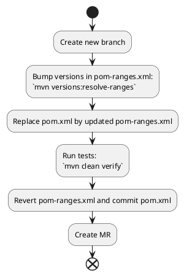

# Maven dependency version ranges

**Since maven X.Y.Z**

Maven allow you to define [dependency version ranges](https://maven.apache.org/pom.html#dependency-version-requirement-specification) just like npm uses [semantic versioning](https://docs.npmjs.com/about-semantic-versioning).

Maven version requirements has the following syntax:
* `1.0`: Soft requirement for `1.0`. Use `1.0` if no other version appears earlier in the dependency tree.
* `[1.0]`: Hard requirement for `1.0`. Use `1.0` and only `1.0`.
* `(,1.0]`: Hard requirement for any version <= `1.0`.
* `[1.2,1.3]`: Hard requirement for any version between `1.2` and `1.3` inclusive.
* `[1.0,2.0)`: `1.0` <= x < `2.0`; Hard requirement for any version between `1.0` inclusive and `2.0` exclusive.
* `[1.5,)`: Hard requirement for any version greater than or equal to `1.5`.
* `(,1.0],[1.2,)`: Hard requirement for any version less than or equal to `1.0` than or greater than or equal to `1.2`, but not `1.1`. Multiple requirements are separated by commas.
* `(,1.1),(1.1,)`: Hard requirement for any version except `1.1`; for example because `1.1` has a critical vulnerability.

ℹ️ Maven picks the **highest** and/or **nearest** version of each project that satisfies all the hard requirements of the dependencies on that project. If no version satisfies all the hard requirements, the build fails. ℹ️

⚠️ **It is a consensus that using version ranges is a bad practice because it can lead to non-reproductible builds since maven does not have a concept of version pinning (e.g. npm `package-lock.json`)** ⚠️

We can however imagine edge cases where it can be interesting to leverage **version ranges**

## Poor's man automated dependency updates

🎙️ **Disclaimer**: I'm not recommending using the method below for sensitive production workloads and without extensive tests. It is mainly presented to propose a possible usage of **version ranges** and does not replace existing solutions. 🎙️

You can use [dependency version ranges](https://maven.apache.org/pom.html#dependency-version-requirement-specification) and [maven versions plugin](https://www.mojohaus.org/versions/versions-maven-plugin/index.html) to implement a very basic solution to automatically and periodically upgrade your dependencies.

The context may be :
* You cannot use [Dependabot](https://github.com/dependabot/dependabot-core) or [Renovate](https://docs.renovatebot.com/) for whatever reasons
* Your project is fairly simple
* Your project has a flat roadmap

### `pom-ranges.xml` file

You can maintain in your **VCS** a `pom-ranges.xml` file which :
* Mirrors the content of `pom.xml`
* Contains tolerated version ranges of your libraries

```xml
<properties>
    <maven.compiler.source>17</maven.compiler.source>
    <maven.compiler.target>17</maven.compiler.target>
    <project.build.sourceEncoding>UTF-8</project.build.sourceEncoding>
    <allowMajorUpdates>false</allowMajorUpdates>
    <allowMinorUpdates>false</allowMinorUpdates>
    <allowIncrementalUpdates>true</allowIncrementalUpdates>
</properties>

<dependencies>
    <dependency>
        <groupId>commons-beanutils</groupId>
        <artifactId>commons-beanutils</artifactId>
        <version>[1.8.0,)</version>
    </dependency>
    <dependency>
        <groupId>org.apache.commons</groupId>
        <artifactId>commons-lang3</artifactId>
        <version>[3.3,)</version>
    </dependency>
</dependencies>
```

### Dependency upgrade automation

See [Pseudo script](./try_dependencies_upgrade.sh)



PoC script execution.

```shell
# The folder should be a git repository
./try_dependencies_upgrade.sh
```

You end up with

```
diff --git a/pom.xml b/pom.xml
index eeee851..a29660b 100644
--- a/pom.xml
+++ b/pom.xml
@@ -24,12 +24,12 @@
         <dependency>
             <groupId>commons-beanutils</groupId>
             <artifactId>commons-beanutils</artifactId>
-            <version>1.8.0</version>
+            <version>1.9.4</version>
         </dependency>
         <dependency>
             <groupId>org.apache.commons</groupId>
             <artifactId>commons-lang3</artifactId>
-            <version>3.3</version>
+            <version>3.12.0</version>
         </dependency>
     </dependencies>
```