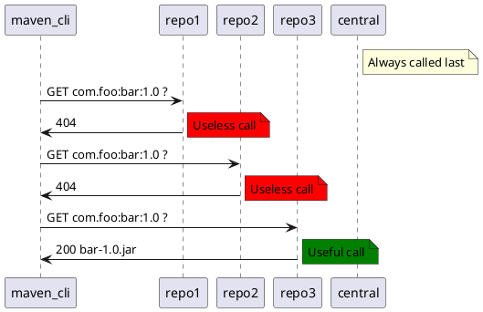

# Maven remote repository filtering

**Since 3.9.0**

[Remote repository filtering](https://maven.apache.org/resolver/remote-repository-filtering.html) (_RRF_) is a maven feature that enable to influence maven artifact download by targeting the correct remote repository.
By default, when fetching an artifact, maven will loop over all the declared remote repositories until it finds one containing the artifact. _Maven central_ is searched last.

This can be problematic, especially if you use **more than one** remote repositories, because :
* It can slow your build as maven can perform useless _N-1_ HTTP requests
* It can leak information about your internal libs (i.e. _GAV_ parameters) to external entities



With this feature you can enable two _filters_ to instruct maven about the correct path to follow.

## Prefix filter

It works by providing a _prefix file_ containing artifact paths prefixes (e.g. `/com/foo`) of all artifacts the remote repository is susceptible to contain.
Remote repositories usually generate and expose those prefix files. Prefixes are generally two (e.g. `/com/foo`) to four (e.g. `/com/foo/bar/baz`) level deep.

See Maven Central [prefixes.txt](https://repo.maven.apache.org/maven2/.meta/prefixes.txt)

The expected use case is to periodically download those files and supply them to maven for client-side filtering to avoid unnecessary outbound HTTP requests.

To use this filter, you must :

1. Enable the filter using : `-Daether.remoteRepositoryFilter.prefixes=true`
2. Provide a filter base directory : `-Daether.remoteRepositoryFilter.prefixes.basedir=<path>`
3. Provide prefix files for remote repositories with the pattern : `prefixes-${remoteRepository.id}.txt`

ℹ️ Any remote that do not have a prefix file is not filtered ℹ️

See [./mvn/rrf/prefixes](./.mvn/rrf/prefixes)

## Group filter

It works by providing a list of authorized _groupId_ per remote repositories allowing stronger constraints than _prefix_ filter.

A remote repository _R1_ can advertise potentially hosting artifacts with prefix `/com/foo/bar` but you want to ensure `com.foo.bar.baz` artifacts are only searched in repository _R2_.

To use this filter, you must :

1. Enable the filter using : `-Daether.remoteRepositoryFilter.groupId=true`
2. Provide a filter base directory : `-Daether.remoteRepositoryFilter.groupId.basedir=<path>`
3. Provide prefix files for remote repositories with the pattern : `groupId-${remoteRepository.id}.txt`

ℹ️ Any remote that do not have a groupId file is not filtered ℹ️

See [./mvn/rrf/groupId](./.mvn/rrf/groupId)

## Practice

1. Build the current project without _RRF_

```shell
mvn clean package -s settings.xml
```

2. You should see **12 artifacts download attempts** and especially those **6 unnecessary** requests below

```
Downloading from gcp-artifact-registry-ro: https://us-central1-maven.pkg.dev/maven-registry/breizhcamp2023/com/syalioune/gitlab/gitlab-artifact/1.0/gitlab-artifact-1.0.pom
Downloading from gcp-artifact-registry-ro: https://us-central1-maven.pkg.dev/maven-registry/breizhcamp2023/com/syalioune/nexus/nexus-artifact/1.0/nexus-artifact-1.0.pom
Downloading from gcp-artifact-registry-ro: https://us-central1-maven.pkg.dev/maven-registry/breizhcamp2023/com/syalioune/gitlab/gitlab-artifact/1.0/gitlab-artifact-1.0.jar
Downloading from gcp-artifact-registry-ro: https://us-central1-maven.pkg.dev/maven-registry/breizhcamp2023/com/syalioune/nexus/nexus-artifact/1.0/nexus-artifact-1.0.jar
Downloading from gitlab-maven-registry-ro: https://gitlab.com/api/v4/groups/68997771/-/packages/maven/com/syalioune/nexus/nexus-artifact/1.0/nexus-artifact-1.0.jar
Downloading from gitlab-maven-registry-ro: https://gitlab.com/api/v4/groups/68997771/-/packages/maven/com/syalioune/nexus/nexus-artifact/1.0/nexus-artifact-1.0.pom
```

3. Manually cleanup your local repository `${user.home}/.m2/repository/com/syalioune`

4. Rebuild the current project with _RRF_

```shell
mvn clean package -s settings.xml \
-Daether.remoteRepositoryFilter.prefixes=true \
-Daether.remoteRepositoryFilter.prefixes.basedir=$(pwd)\.mvn\rrf\prefixes \
-Daether.remoteRepositoryFilter.groupId=true \
-Daether.remoteRepositoryFilter.groupId.basedir=$(pwd)\.mvn\rrf\groupId
```

5. You should only see **6 successful artifact download**

```
Downloading from gcp-artifact-registry-ro: https://us-central1-maven.pkg.dev/maven-registry/breizhcamp2023/com/syalioune/gcp/gcp-artifact/1.0/gcp-artifact-1.0.pom
Downloading from gitlab-maven-registry-ro: https://gitlab.com/api/v4/groups/68997771/-/packages/maven/com/syalioune/gitlab/gitlab-artifact/1.0/gitlab-artifact-1.0.pom
Downloading from nexus-maven-registry-ro: http://nexus.breizhcamp.syalioune.com/repository/breizhcamp/com/syalioune/nexus/nexus-artifact/1.0/nexus-artifact-1.0.pom
Downloading from gcp-artifact-registry-ro: https://us-central1-maven.pkg.dev/maven-registry/breizhcamp2023/com/syalioune/gcp/gcp-artifact/1.0/gcp-artifact-1.0.jar
Downloading from gitlab-maven-registry-ro: https://gitlab.com/api/v4/groups/68997771/-/packages/maven/com/syalioune/gitlab/gitlab-artifact/1.0/gitlab-artifact-1.0.jar
Downloading from nexus-maven-registry-ro: http://nexus.breizhcamp.syalioune.com/repository/breizhcamp/com/syalioune/nexus/nexus-artifact/1.0/nexus-artifact-1.0.jar
```
