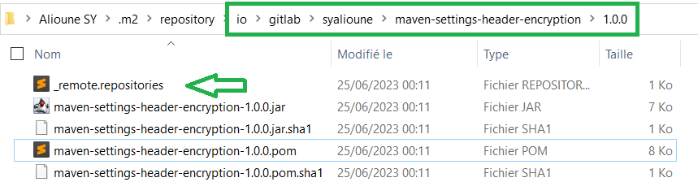
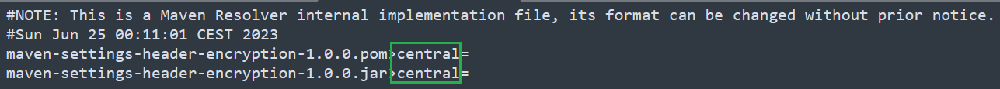

# Maven enhanced local repository layout

**Since 3.9.0**

Maven uses by default a standard local repository based on _GroupId:ArtifactId:Version_ (`GAV`) coordinates.

A dependency with the following `GAV`

```xml
<dependency>
    <groupId>io.gitlab.syalioune</groupId>
    <artifactId>maven-settings-header-encryption</artifactId>
    <version>1.0.0</version>
</dependency>
```

result in the following tree



with `_remote.repositories` used by `maven-resolver` to track the dependency origin



This standard layout can be **altered** by configuring [maven enhanced local repository manager](https://maven.apache.org/resolver/local-repository.html).
This enables the following _theoritical_ use cases :

* **Enhanced transparency** by being able to simply differentiate in the repository
  * Artifacts **built locally** vs Artifacts **downloaded from remote repositories** : You can clean local repository without re-downloading the entire internet
  * Artifacts downloaded from remote repositories by **origins** : You can clean all artifacts from a specific repository
* **Simplified branch development** : working on parallel branches producing artifact with the same coordinates by
  * Isolating locally built artifacts by branches
  * Being able to compare results from different branches without overwriting them

See [maven resolver configuration](https://maven.apache.org/resolver/configuration.html)

# Use cases

## Enhanced transparency

1. Build the entire project to have the parent module installed into the local repository

```shell
cd ../
mvn clean install -s repository-layout/settings.xml \
-Daether.enhancedLocalRepository.split=true \
-Daether.enhancedLocalRepository.splitRemoteRepository=true \
-Daether.enhancedLocalRepository.splitRemote=true \
-Daether.enhancedLocalRepository.localPrefix=breizhcamp/local \
-Daether.enhancedLocalRepository.remotePrefix=breizhcamp/remote
```

2. Delete locally built artifacts for `com.syalioune.gcp:gcp-artifact:1.0`, `com.syalioune.gitlab:gitlab-artifact:1.0`, `com.syalioune.nexus:nexus-artifact:1.0`

```shell
rm -rf ~/.m2/repository/breizhcamp/local/com/syalioune/gcp
rm -rf ~/.m2/repository/breizhcamp/local/com/syalioune/gitlab
rm -rf ~/.m2/repository/breizhcamp/local/com/syalioune/nexus
```

3. Build the `repository-layout` project

```shell
mvn clean install -s settings.xml \
-Daether.enhancedLocalRepository.split=true \
-Daether.enhancedLocalRepository.splitRemoteRepository=true \
-Daether.enhancedLocalRepository.splitRemote=true \
-Daether.enhancedLocalRepository.localPrefix=breizhcamp/local \
-Daether.enhancedLocalRepository.remotePrefix=breizhcamp/remote
```

4. Final repository layout

```shell
.                                                                                                            
├── local                                                                                                    
│   └── com                                                                                                  
│       └── syalioune                                                                                                                                                                                                                                                                                                                                                                                                                                  
│           └── settings-encryption                                                                                                                                                             
└── remote                                                                                                   
    ├── central                                                                                              
    │   └── releases                                                                                         
    │       ├── aopalliance                                                                                                                                                                                                                                                                                                                                    
    ├── gcp-artifact-registry-ro                                                                             
    │   └── releases                                                                                         
    │       └── com                                                                                          
    │           └── syalioune                                                                                
    ├── gitlab-maven-registry-ro                                                                             
    │   └── releases                                                                                         
    │       └── com                                                                                          
    │           └── syalioune                                                                                
    └── nexus-maven-registry-ro                                                                              
        └── releases                                                                                         
            └── com                                                                                          
                └── syalioune                                                                                
```

## Simplified branch development

Suppose that you work on two different branches `feature/A` and `feature/B` having the same `GAV` coordinates.

You can isolate work from the two branches by using `-Daether.enhancedLocalRepository.localPrefix=breizhcamp/local/<branch>`

1. `feature/A` branch

```shell
mvn clean install -s settings.xml \
-Daether.enhancedLocalRepository.split=true \
-Daether.enhancedLocalRepository.splitRemoteRepository=true \
-Daether.enhancedLocalRepository.splitRemote=true \
-Daether.enhancedLocalRepository.localPrefix=breizhcamp/local/feature-A \
-Daether.enhancedLocalRepository.remotePrefix=breizhcamp/remote
```

2. `feature/B` branch

```shell
mvn clean install -s settings.xml \
-Daether.enhancedLocalRepository.split=true \
-Daether.enhancedLocalRepository.splitRemoteRepository=true \
-Daether.enhancedLocalRepository.splitRemote=true \
-Daether.enhancedLocalRepository.localPrefix=breizhcamp/local/feature-B \
-Daether.enhancedLocalRepository.remotePrefix=breizhcamp/remote
```

3. Final repository layout

```shell
.
├── local
│   ├── feature-A
│       └── com
│           └── syalioune
│               ├── repository-layout
│   └── feature-B
│       └── com
│           └── syalioune
│               ├── repository-layout
└── remote
    ├── central
    ├── gcp-artifact-registry-ro
    ├── gitlab-maven-registry-ro
    └── nexus-maven-registry-ro
        └── releases
            └── com
                └── syalioune
```